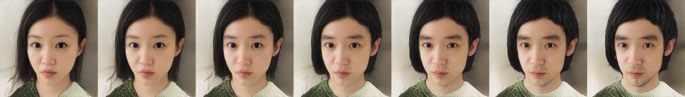
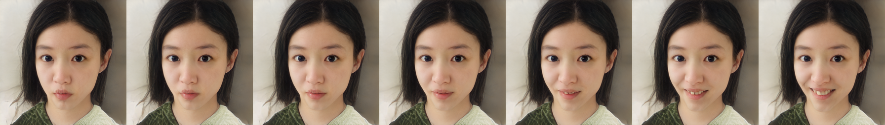
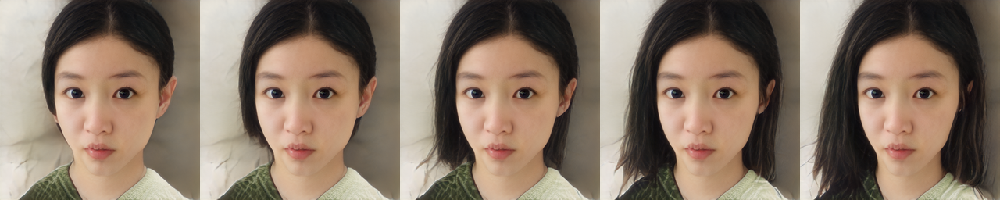
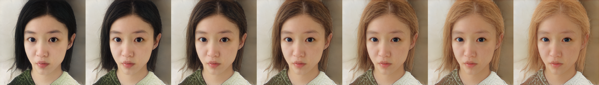

# StyleCLIP: Text-Driven Manipulation of StyleGAN Imagery
## StyleGAN V2 Clip guided Editing 原理

StyleGAN V2 的任务是使用风格向量进行image generation，而Clip guided Editing 则是利用CLIP (Contrastive Language-Image Pre-training ) 多模态预训练模型计算文本输入对应的风格向量变化，用文字表述来对图像进行编辑操纵风格向量进而操纵生成图像的属性。相比于Editing 模块，StyleCLIP不受预先统计的标注属性限制，可以通过语言描述自由控制图像编辑。

原论文中使用 Pixel2Style2Pixel 的 升级模型 Encode4Editing 计算要编辑的代表图像的风格向量，为尽量利用PaddleGAN提供的预训练模型本次复现中仍使用Pixel2Style2Pixel计算得到风格向量进行实验，重构效果略有下降，期待PaddleGAN跟进e4e相关工作。


## 使用方法
### 训练
本次仅复现论文中效果最好的 Global Direction 方法。

StyleClip

```
python styleclip_getf.py
```
### 编辑

用户使用如下命令中对图像属性进行编辑：

```
cd applications/
python -u tools/styleganv2clip.py \
       --latent <替换为要编辑的风格向量的路径> \
       --output_path <替换为生成图片存放的文件夹> \
       --weight_path <替换为你的预训练模型路径> \
       --model_type ffhq-config-f \
       --size 1024 \
       --style_dim 512 \
       --n_mlp 8 \
       --channel_multiplier 2 \
       --direction_path <替换为存放统计数据的文件路径> \
       --neutral <替换为对原图像的描述，如face> \
       --target <替换为对目标图像的描述> \
       --beta_threshold 0.12 \
       --direction_offset 5
       --cpu
```

**参数说明:**
- latent: 要编辑的代表图像的风格向量的路径。可来自于Pixel2Style2Pixel生成的`dst.npy`或StyleGANv2 Fitting模块生成的`dst.fitting.npy`
- output_path: 生成图片存放的文件夹
- weight_path: 或StyleGANv2 预训练模型路径
- model_type: PaddleGAN内置模型类型，若输入PaddleGAN已存在的模型类型，`weight_path`将失效。当前建议使用: `ffhq-config-f`
- size: 模型参数，输出图片的分辨率
- style_dim: 模型参数，风格z的维度
- n_mlp: 模型参数，风格z所输入的多层感知层的层数
- channel_multiplier: 模型参数，通道乘积，影响模型大小和生成图片质量
- direction_path: 存放一系列属性名称及对象属性向量的文件的路径。默认为空，即使用ppgan自带的文件。若不使用，请在命令中去除
- neutral: 对原图像的中性描述，如 face
- target: 为对目标图像的描述，如 young face
- beta_threshold: 向量调整阈值
- direction_offset: 属性的偏移强度
- cpu: 是否使用cpu推理，若不使用，请在命令中去除

## 编辑结果展示

风格向量对应的图像:
<div align="center">
    
</div>

设置
> direction_offset = [ -1, 0, 1, 2, 3, 4, 5]
> beta_threshold = 0.1

从 'face' 到 'boy face' 编辑得到的图像:

<div align="center">
    
</div>

从'face' 到 'happy face' 编辑得到的图像:

<div align="center">
    
</div>


从'face' 到 'face with long hair' 编辑得到的图像:

<div align="center">
    
</div>


从'head with black hair'（黑发） 到 'head with gold hair'（金发）编辑得到的图像:

<div align="center">
    
</div>


# 参考文献
- 1. [Encoding in Style: a StyleGAN Encoder for Image-to-Image Translation](hhttps://arxiv.org/abs/2008.00951)

  ```
  @article{richardson2020encoding,
    title={Encoding in Style: a StyleGAN Encoder for Image-to-Image Translation},
    author={Richardson, Elad and Alaluf, Yuval and Patashnik, Or and Nitzan, Yotam and Azar, Yaniv and Shapiro, Stav and Cohen-Or, Daniel},
    journal={arXiv preprint arXiv:2008.00951},
    year={2020}
  }
  ```
